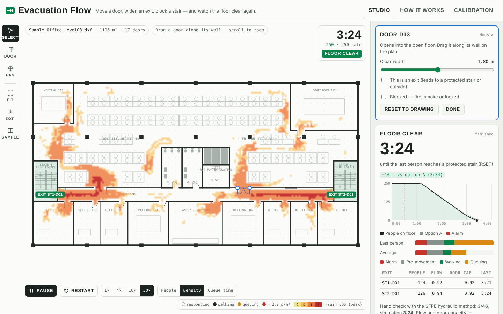

# Evacuation Flow

An agent-based evacuation simulator for floor plans that runs entirely in the browser. Load a DXF floor plate, confirm the exits, then move a door, widen an exit or block a stair and watch the clearance time and the bottleneck heatmap update.



> **Scope.** This is a design-exploration tool. It isn't a validated or certified egress model, and it isn't a substitute for a UAE Fire & Life Safety Code review by Civil Defence or an accredited consultant. See [Limits](#limits).

## Quick start

No install needed. Open `dist/index.html` in a browser. It is one self-contained file with the sample floor embedded; only the Google Fonts load from the web.

```bash
python3 tools/build.py          # rebuild dist/ from src/
node tests/engine.test.js       # engine verification (IMO tests + door-flow sweep) in Node
python3 tests/browser_check.py  # optional headless-Chromium smoke test (needs Playwright)
```

To publish on **GitHub Pages**, go to Settings → Pages → Deploy from branch → `main` / `/dist`. Then `dist/index.html` is served at `https://<you>.github.io/<repo>/`.

## What it does

| Area | Details |
|---|---|
| DXF import | Parses LINE, LWPOLYLINE/POLYLINE, ARC, CIRCLE, ELLIPSE, SOLID, TEXT/MTEXT, INSERT (nested blocks, attributes). Units come from `$INSUNITS` or are guessed from the drawing extent. You map each layer to a role: wall, door, fire door, stair, exit signage, furniture, obstacle or ignore. |
| Door reading | Hinge, width and swing side are read from the door block's arc and leaf. Double doors are detected from two arcs. Moving a door patches the old opening shut and cuts a new one. |
| Exit detection | Each door is scored on several clues: fire-door block or layer (FD rating attribute), an EXIT sign within 3 m, "EXIT / STAIR / ESCAPE / مخرج" text nearby, and a flood fill on the swing side that finds stair geometry or reaches the outside. Exits are suggested, and you confirm them. |
| Routing | A 16-neighbour Dijkstra distance field per exit on a 0.1 m grid, run in configuration space (0.2 m body clearance, so nobody is routed through desk slots), with a penalty for hugging walls. A steepest-descent fallback handles watersheds. Exit choice is either nearest, or queue-aware (re-decided every second). |
| Movement | Social Force Model (Helbing, Farkas & Vicsek 2000), with anisotropy, wall forces from a Euclidean feature transform, small fluctuation noise, and release for stalled agents (shoulder rotation). |
| Pre-movement | Detection and alarm delay, plus a response-time distribution: PD 7974-6 presets (log-normal fitted through the 1st and 99th percentiles), log-normal, uniform, normal, fixed or none. |
| Results | Clearance time (RSET), a curve of people remaining, a time breakdown (alarm, pre-movement, walking, queuing), per-exit flow, an SFPE hydraulic hand check, and an A/B comparison of options. |
| Heatmaps | Peak density banded by Fruin Level of Service, or time spent above 1.08 p/m² (queuing). |
| Monte Carlo | 10–50 replications in a Web Worker, reporting the median, 95th percentile and range. |
| Code checks | Indicative prescriptive checks: number of exits, travel distance, exit capacity, loss of one exit, remoteness. Limits are editable (defaults are NFPA 101, sprinklered business occupancy). |
| Calibration tab | Runs IMO MSC.1/Circ.1533 tests 1, 4 and 6 and a door-width flow sweep against SFPE, in the browser. |

## Verification (engine, `node tests/engine.test.js`)

| Test | Expected | Result |
|---|---|---|
| IMO 1: 40 m corridor at 1.0 m/s | 40 s | 40.6 s ✔ |
| IMO 4: 100 people, 8 × 5 m room, 1 m exit | ≤ 1.33 p/s | 0.92 p/s ✔ |
| IMO 6: 20 people round a corner | all through, no wall crossings | 20/20 ✔ |

| Door width | Engine (p/s) | SFPE 1.32 × (W − 0.3) |
|---|---|---|
| 0.8 m | 0.63 | 0.66 |
| 1.0 m | 1.01 | 0.92 |
| 1.2 m | 1.42 | 1.19 |
| 1.6 m | 2.30 | 1.72 |
| 2.0 m | 3.17 | 2.24 |

The engine matches the SFPE values for doors up to about 1.2 m. Wider doors flow faster than SFPE predicts, toward measured bottleneck data.

## Repository layout

```
src/
  core.js         simulation engine: rasterising, EDT, distance fields, social force, metrics (no DOM)
  dxf.js          DXF parser, block flattening, layer roles, door reading, exit detection
  testscenes.js   IMO / SFPE test geometries
  app.js          UI: canvas rendering, editing, panels, Monte Carlo worker
  template.html   markup + CSS; build.py inlines the modules and the sample DXF
tools/build.py    builds dist/
dist/
  index.html            standalone page (GitHub Pages)
  evacuation-flow.html  page fragment as published to Claude artifacts
samples/
  Sample_Office_Level03.dxf          fictional 48 × 24 m office floor (mm, AIA-style layers)
  Sample_Office_Level03_preview.png
  make_sample_dxf.py                 regenerates the sample (pip install ezdxf)
  render_preview.py                  renders the PNG preview (ezdxf + matplotlib)
tests/
  engine.test.js    Node verification run
  browser_check.py  headless-browser smoke test (Playwright)
docs/screenshots/
```

The modules in `src/` load in Node (`require('./src/core.js')`) as well as in the browser, so the engine can be tested and scripted headless.

## Limits

- Single floor. Exits are protected-stair doors or doors to outside. The optional stair-discharge limit approximates the stair below, but floors don't merge.
- No smoke, fire growth or ASET. Compare the RSET against an ASET from your fire engineer.
- No groups, wardens or people with reduced mobility.
- PD 7974-6 presets for office (A) occupants were checked against published citations. Check the retail (B) and M3 rows against the edition you design to.
- Code-check limits default to NFPA 101 values. Replace them with the figures from the applicable UAE Fire & Life Safety Code edition.

## References

Helbing, Farkas & Vicsek (2000) *Nature* 407 · Helbing & Molnár (1995) *Phys. Rev. E* 51 · Hughes (2002) *Transp. Res. B* 36 · SFPE Handbook, hydraulic model (Gwynne & Rosenbaum) · BSI PD 7974-6:2019 · IMO MSC.1/Circ.1533 · Fruin (1971) *Pedestrian Planning and Design* · Weidmann (1993) · NFPA 101.
